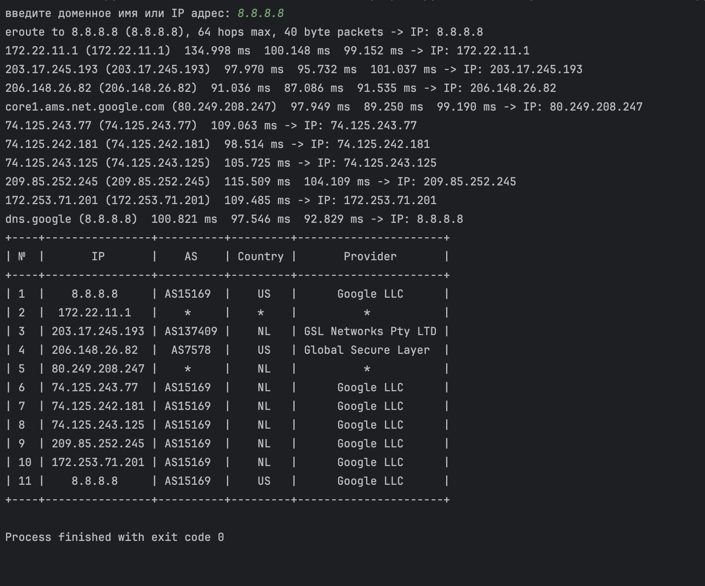

# Трассировка автономных систем.
___
## Описание
Traceroute AS Inspector — это утилита,
которая позволяет юзеру определить маршрут пакетов от нашего компьютера до заданного хоста (IP-адреса или доменного имени),
а также узнать, к каким автономным системам,
странам и провайдерам(делал на 10 баллов) принадлежат промежуточные маршрутизаторы

Программа делает трассировку сети (через traceroute),
извлекает IP-адреса промежуточных узлов и запрашивает у ipinfo.io сведения о каждой IP-адресации
___
## Код
### Константы
1. ip_regex - эта регулярка проверяет IP-адреса на необходимый формат x.x.x.x (где x — от 0 до 255)
2. not_resolve_node - сообщение об ошибке, если домен не может быть разрешён
3. tracing_route — начало строки с маршрутом (traceroute to \<host>)
4. time_limit — строка из traceroute, показывающая таймаут (звёздочки *), если узел не ответил

### Функции
1. get_console_tracer - запускает traceroute \<hostname> через subprocess.Popen. перехватывает вывод и ошибку
	возвращает генератор, который построчно читает вывод команды (одна строка за раз — readline)
2. get_ip_info - Обращается к сервису ipinfo.io. получает JSON ответ, содержащий данные о:
	IP-адресе, автономной системе (org), стране, городе, и т.д. преобразует JSON в Python словарь
3. get_list_ip - выполняет трассировку до заданного хоста (address) с помощью get_console_tracer. пошагово анализирует результат трассировки. из каждой строки извлекает IP-адреса.
	учитывает различные ситуации: ошибка разрешения адреса (unknown host), вводная строка трассировки (traceroute to ...),
	потеря пакета (* * *) — учитывается 3 раза, затем трассировка обрывается, повторяющийся IP — выход из цикла.
    то есть, декодирует строку в cp866, т.к. traceroute может выводить в этой кодировке,
	если в строке есть IP — добавляет его в список, сохраняет все IP-адреса промежуточных узлов маршрута, возвращает список IP-адресов, по которым прошёл маршрут
4. get_table - создаёт таблицу с колонками №, IP, AS, Country, Provider.
	для каждого IP из списка: получает информацию через get_ip_info
	Извлекает:
	ip — фактический IP (иногда может отличаться), org — автономная система + провайдер (в одной строке), country — страна,
	разделяет org: первая часть — номер AS, остальные — название провайдера,
	добавляет строку в таблицу с порядковым номером и всей полученной информацией
5. main - запрашивает у пользователя доменное имя или IP,
	запускает трассировку и получает список IP-адресов маршрута, если IP не найден — сообщает об этом,
	если IP-адреса найдены — строит таблицу и выводит её на экран

### Описание алгоритма
когда юзер запускает программу, она начинает с выполнения функции main(). в самом начале пользователю предлагается ввести доменное имя или IP-адрес. это может быть, например, google.com, 8.8.8.8 или любой другой узел в интернете, до которого можно построить маршрут

после ввода адреса, программа передаёт его в функцию get_list_ip(address), которая отвечает за выполнение трассировки. внутри этой функции вызывается get_console_tracer(address), которая запускает системную команду traceroute и начинает читать её построчный вывод в режиме реального времени

команда traceroute показывает путь, по которому сетевой пакет проходит от текущего устройства до целевого хоста. каждая строка содержит сведения об очередном узле маршрута, включая его IP-адрес, задержку (в миллисекундах), либо — в случае недоступности — звёздочки * * *

функция get_list_ip анализирует каждую строку трассировки. из строки извлекаются IP-адреса при помощи регулярного выражения. программа игнорирует строки, в которых нет IP (например, заголовок или строки с ошибкой). если несколько строк подряд содержат только * * *, считается, что маршрут прерван, и трассировка завершается. также, если начальный и конечный IP повторяются, программа завершает сбор IP-адресов — это означает, что маршрут «замкнулся»

в результате формируется список IP-адресов маршрутизаторов, через которые прошёл пакет по пути до цели. этот список передаётся в функцию get_table(ip_list), которая отвечает за сбор дополнительной информации об этих IP

далее программа последовательно перебирает каждый IP-адрес и отправляет HTTP-запрос к открытому API-сервису ipinfo.io. этот сервис возвращает данные в формате JSON, среди которых:
	ip — подтверждённый IP-адрес, org — информация об автономной системе и провайдере, country — страна, где зарегистрирован IP

значение org обычно содержит строку вида "AS15169 Google LLC", где AS15169 — номер автономной системы, а Google LLC — провайдер. программа автоматически разделяет эти значения: первая часть сохраняется как AS, оставшаяся строка, как имя провайдера

затем каждая строка данных добавляется в красивенькую табличку при помощи библиотеки prettytable. эта таблица содержит пять столбцов: порядковый номер, IP-адрес, номер автономной системы, страна и провайдер

после того как все IP-адреса обработаны, таблица выводится на экран, показывая пользователю полный маршрут, а также где находятся промежуточные узлы и каким организациям они принадлежат

на этом работа программы завершается
___

## Пример запуска
на скрине можно увидеть, что выводятся все шаги, то есть маршрут, в виде классического вывода traceroute, а потом, на основе этой информации, формируется табличка

