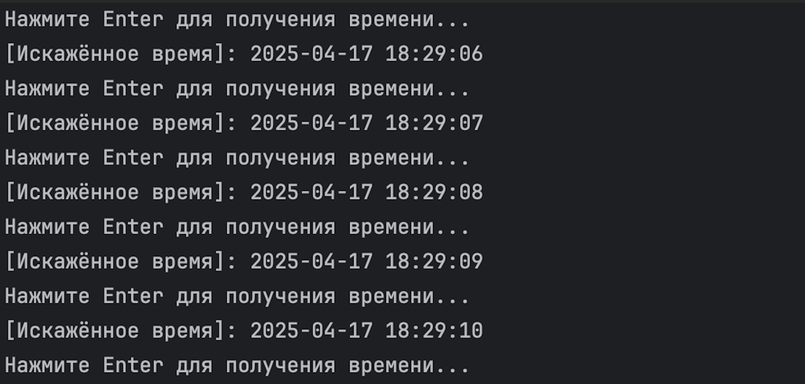
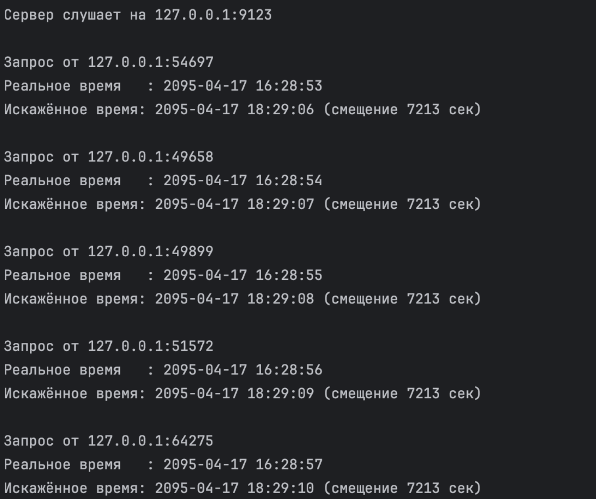

# Лживый SNTP-сервер
___
## Описание
Это простая утилита, имитирующая работу SNTP-сервера, но с «искажённым» временем.
Сервер получает точное время от другого SNTP-сервера и прибавляет или вычитает определённое число секунд, данное в конфиге.
Затем это изменённое время отправляется клиенту

Клиент может запросить это время в любой момент и увидеть результат прямо в терминале

Полезно, если нужно протестировать работу систем, которые чувствительны к времени
___
## Код 
### Конфигурация
`[clock] 
source = time.nist.gov        # источник точного времени (SNTP-сервер)
distortion = 7213             # смещение в секундах (положительное или отрицательное)`
### fuzzy_time_server.py — запуск SNTP-сервера
Класс FuzzyClockServer:
1.	init:
Загружает конфиг: откуда брать время (source) и на сколько “врать” (distortion)
2. _retrieve_reference_time():
Посылает UDP-запрос на внешний SNTP-сервер (например, time.nist.gov)
Получает точное время, переводит в обычный формат (timestamp)
3.	_apply_distortion():
Добавляет смещение distortion к полученному времени
4.	_build_response():
Переводит искажённое время обратно в формат NTP (секунды и доли секунд)
5.	launch():
Запускает UDP-сервер на 127.0.0.1:9123
При получении запроса:
получает текущее точное время, добавляет смещение,
показывает в терминале оба времени: точное и искажённое,
отправляет клиенту бинарный ответ с искажённым временем
### fuzzy_client.py — клиент SNTP
1. uest_fuzzy_time(): Отправляет UDP-запрос серверу
Получает бинарный ответ с искажённым временем
Преобразует в datetime и возвращает
2. main: В цикле ждёт нажатия Enter
После каждого нажатия получает и выводит новое “искажённое время”
## Описание алгоритма
Когда запускается сервер:
он читает settings.ini, находит SNTP-сервер и число секунд, на которые нужно «врать» (например +7213 секунд),
ждёт входящих UDP-запросов

Когда клиент нажимает Enter:
он посылает UDP-запрос на сервер (например, 127.0.0.1:9123),
сервер получает этот запрос, обращается к внешнему точному SNTP-серверу,
получает от него текущее точное время,
прибавляет или вычитает смещение из settings.ini,
пересылает клиенту новое значение в формате NTP,
клиент его распаковывает и показывает пользователю в удобном формате
## Пример запуска
На скрине ниже видно: 
как клиент по нажатию Enter получает каждую секунду новое время, и оно идёт с учётом смещения +7213 секунд
как сервер показывает точное и искажённое время, а также от кого пришёл запрос

