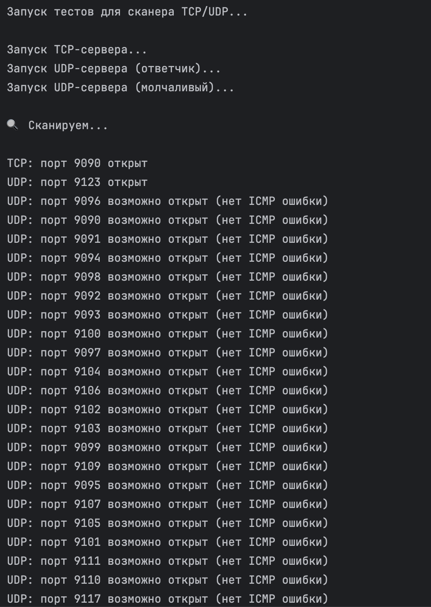

# Сканер TCP и UDP портов
## Описание
это утилита для сканирования портов на заданном IP-адресе. она позволяет определить, какие TCP и UDP порты открыты в указанном диапазоне
особенности реализации:
параллельное сканирование TCP и UDP портов с помощью многопоточности, \
учитываются особенности поведения UDP: если на закрытый порт не приходит ICMP-сообщение о недоступности, он считается "возможно открытым", \
подходит для проверки как в реальной среде, так и в локальной (localhost), где нет проблем с ICMP-блокировками, \
эта реализация соответствует требованиям на 10 баллов:

5 баллов — определение открытых TCP портов в заданном диапазоне \
+5 баллов — добавлено параллельное выполнение + проверка UDP портов с учётом ICMP \
у меня реализовано на 10 баллов
## Код
### scanner.py — основной сканер

Класс Target:\
__init__: принимает IP-адрес и диапазон портов. Проверяет IP через регулярное выражение.

Класс SimplePortScanner:\
__init__: сохраняет целевой IP и диапазон портов\
check_tcp(port): проверяет TCP порт с таймаутом. Возвращает строку, если порт открыт\
check_udp(port): посылает UDP-пакет. Если получен ответ — порт точно открыт. Если нет — выводит "возможно открыт (нет ICMP ошибки)"\
run(): запускает параллельное сканирование TCP и UDP портов через ThreadPoolExecutor. Собирает и возвращает результаты\
Функции:\
parse_args(): разбирает аргументы командной строки: IP, начальный и конечный порт\
main(): запускает сканирование и выводит результат
### scanner_tests.py — тестирование сканера
Модуль запускает локальные TCP и UDP серверы для имитации различных состояний портов:\

run_tcp_server(port): запускает HTTP-сервер на указанном порту (открытый TCP)\
udp_echo_server(port): UDP-сервер, который отвечает на входящие сообщения (открытый UDP)\
udp_silent_server(port): UDP-сервер, который получает, но не отвечает (моделирует "возможно открыт")\
start_threaded_server(func, port): запускает сервер в отдельном потоке\
run_scan(start, end): запускает SimplePortScanner для диапазона портов\
main(): запускает тестовые серверы, ждёт запуска, затем сканирует порты и выводит результаты
### Описание алгоритма
1. Пользователь запускает программу scanner.py с аргументами: IP, начальный и конечный порт
2. Класс Target проверяет IP-адрес и сохраняет диапазон портов
3. Класс SimplePortScanner начинает сканирование TCP и UDP портов в отдельных потоках

#### TCP:
Устанавливается соединение с каждым портом через socket.connect()\
Если соединение успешно — порт считается открытым\
#### UDP:
Отправляется короткое сообщение ("ping")\
Если получен ответ — порт считается открытым\
Если нет ответа, но и нет ICMP-ошибки — выводится "возможно открыт (нет ICMP ошибки)"\
Потоки собираются, результаты сохраняются и выводятся пользователю

## Пример запуска
запускаю через тесты, чтобы сымитировать все возможные состояния
