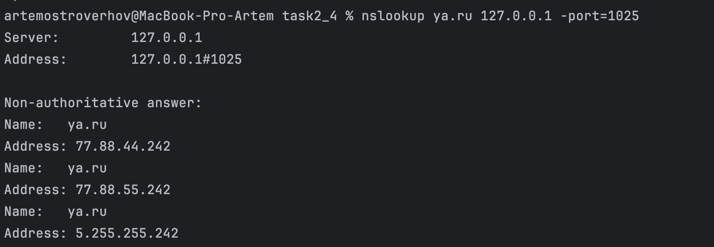

# Кэширующий DNS-сервер
## Описание
Это реализация собственного рекурсивного кэширующего DNS-сервера, который:
принимает DNS-запросы от клиентов (например, nslookup),\
выполняет полное DNS-разрешение через вышестоящий сервер (например, 8.8.8.8),\
сохраняет ВСЕ полезные ресурсы из ответа (Answer, Authority, Additional),\
кэширует результаты по ключу (имя, тип записи) на основе поля TTL,\
умеет сохранять и загружать кэш при перезапуске,\
обслуживает типы A, AAAA, NS, PTR,\
регулярно чистит просроченные записи в фоне

Сервер полностью автономен и работает через UDP на 127.0.0.1:1025
___
## Особенности реализации
Двусторонний кэш: имя → значение и значение → имя\
Извлечение всех записей из ответа DNS (Answer, Authority, Additional)\
TTL учитывается, просроченные записи удаляются автоматически\
Сериализация кэша на диск (cache.db) и загрузка при старте\
Поддержка записей: A, AAAA, NS, PTR\
Простота запуска: работает без root-доступа (через порт 1025)\
Совместим с nslookup, dig, любыми DNS-клиентами
___
## Структура кода
### Константы
CACHE_FILE — имя файла для хранения кэша\
DNS_PORT — порт, на котором работает сервер\
SUPPORTED_TYPES — типы DNS-записей, которые кэшируются
### Класс DNSCache
Отвечает за хранение и управление кэшем\
Методы:\
__init__() — инициализация и загрузка кэша из файла\
set(name, rtype, data, ttl) — сохранить запись (например: ya.ru, A, 77.88.55.242)\
get(name, rtype) — получить запись, если она ещё не просрочена\
cleanup() — удалить все устаревшие записи (по TTL)\
save() / _load() — сериализация/десериализация с помощью pickle
### Класс DNSParser
Отвечает за низкоуровневый парсинг DNS-запроса и DNS-ответа\
Методы:\
parse_question(data) — извлекает список вопросов из DNS-запроса\
parse_response(data) — извлекает список всех записей из секций: Answer, Authority, Additional\
Результат: [(имя, тип, значение, TTL), ...]
### Класс DNSServer
Основной сервер\
Методы:\
__init__() — инициализация, запуск фоновой очистки кэша\
serve() — запускает прослушку UDP-запросов на 127.0.0.1:1025\
_handle(data, addr, sock) — обработка конкретного запроса\
если запись в кэше — вернёт из кэша\
иначе — отправит рекурсивный запрос вверх, закэширует все подходящие записи\
_forward(query) — отправляет запрос на 8.8.8.8, возвращает ответ\
_build_response(query, ip) — создаёт минимальный DNS-ответ для A-запросов
### Описание алгоритма
1.	Сервер запускается и слушает порт 1025 на 127.0.0.1
2. При получении запроса:\
извлекаются все вопросы из запроса\
для каждого: если запись в кэше — берётся оттуда\
иначе — запрос уходит на 8.8.8.8
3. Ответ от вышестоящего DNS анализируется:\
все A/AAAA/NS/PTR записи сохраняются в кэш (с TTL)
4.	Ответ отправляется обратно клиенту
5.	Каждые 30 секунд сервер очищает устаревшие записи из кэша
6.	При завершении (Ctrl+C) — сервер сохраняет кэш в файл
### Пример кэша
`{
  ('ya.ru', '0001'): {'data': '77.88.55.242', 'expire': 1713371813.55174},
  ('google.com', '0002'): {'data': 'ns1.google.com', 'expire': 1713372000.00000}
}`
### Пример запуска
