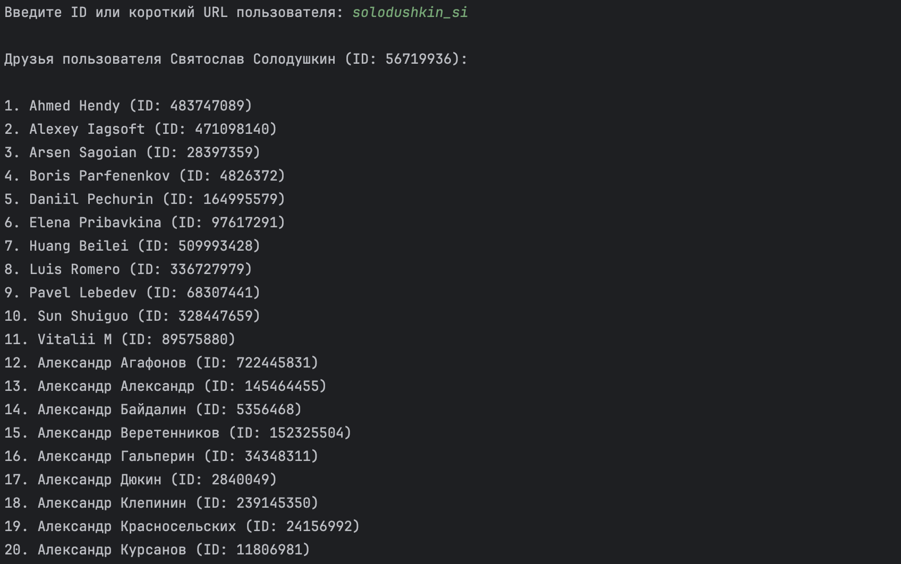

# VK API Клиент: Друзья пользователя
## Описание
Это утилита на Python, которая подключается к API социальной сети ВКонтакте и позволяет:\
получить информацию о любом пользователе по его user_id или короткому имени;\
вывести список всех его друзей с именами и идентификаторами\
Программа работает с использованием токена доступа, полученного через VK OAuth 2.0.
Токен загружается из локального файла token.txt, что упрощает безопасное использование\
Утилита полезна для знакомства с VK API, работы с авторизацией и REST-запросами, а также как шаблон для расширения
___
## Особенности реализации
Получение access_token через VK OAuth вручную, с сохранением в token.txt\
Отделение логики API и логики отображения\
Обработка ошибок (неверный токен, несуществующий пользователь и т.д.)\
Запрос и вывод друзей с сортировкой по имени\
Возможность использовать user_id, screen_name, короткую ссылку
___
## Структура кода
### Класс VKClient
отвечает за работу с API ВКонтакте\
методы:\
__init__(token_path: str) — загружает токен из файла\
_request(method: str, **params) — выполняет универсальный GET-запрос к API\
get_user_info(user_identifier: str) — возвращает id, имя и фамилию пользователя\
get_friends(user_id: int) — возвращает список друзей пользователя
### Класс FriendViewer
отвечает за отображение данных\
методы:\
__init__(api_client: VKClient) — принимает экземпляр VK API-клиента\
show_friends(user_input: str) — выводит имя пользователя и список его друзей
### Файл token.txt
Файл, содержащий access_token, полученный вручную через VK OAuth
### Функция main()
1.	Загружает токен из token.txt
2. Спрашивает у пользователя user_id или короткий URL
3. Показывает друзей этого пользователя
___
## Описание алгоритма
### 1. Загрузка токена
•	Класс VKClient читает файл token.txt\
•	Если файл отсутствует — программа завершает выполнение с сообщением об ошибке\
•	Считанный access_token сохраняется внутри объекта VKClient
### 2. Ввод идентификатора пользователя
•	В main() вызывается input(), предлагая ввести:\
числовой user_id, или короткое имя\
•	Эта строка передаётся в метод show_friends()
### 3. Получение информации о пользователе
•	Внутри show_friends() вызывается метод get_user_info() из VKClient\
•	Он отправляет GET-запрос к методу users.get\
•	Ответ содержит first_name, last_name, id и другую информацию
### 4. Проверка корректности пользователя
•	Если пользователь не найден (например, неверный screen_name), программа выводит сообщение "пользователь не найден" и завершает выполнение метода
### 5. Получение списка друзей
•   Выводится заголовок "друзья пользователя.." и дальше приходит список объектов: имя, фамилия, id
### 6. Отображение друзей
### 7. Обработка ошибок
•	Любая ошибка API (invalid_token, user not found, network error) перехватывается в методе _request()
___
## Пример запуска
### Пример запуска
